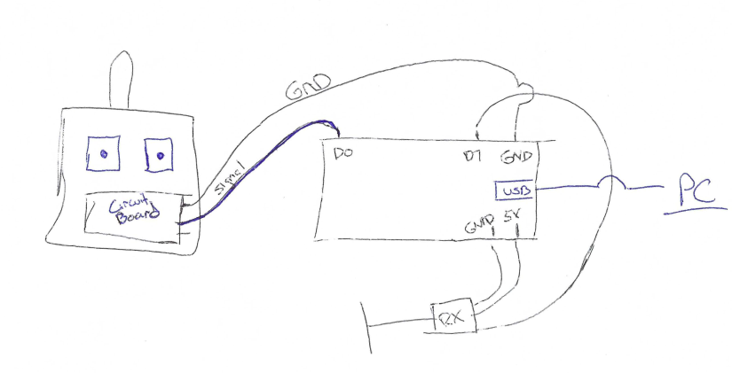
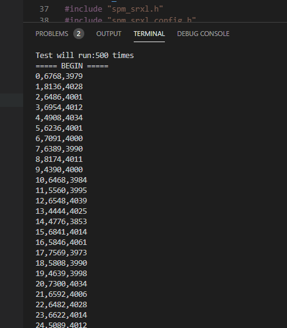

# RClatency Tester
This code is designed to run on an ESP8266 board and measures the end-to-end latency of various RC protocols. You will need an ESP8266 nodemcu or similar. 

The following protocols are supported:
CRSFv2
GHST
SBUS

Connect like so, hit upload and mointor in platformIO then press the button on the board board to begin getting results 

