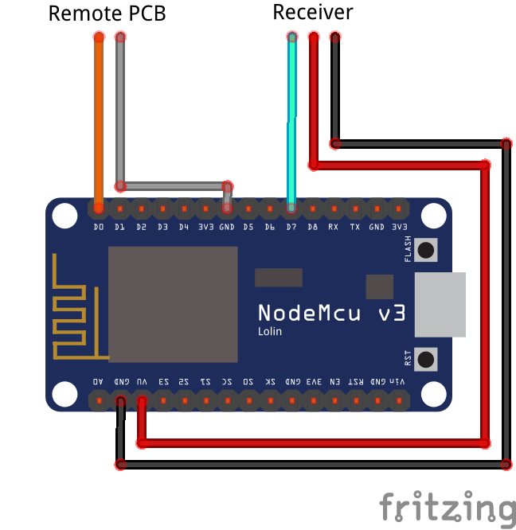

# RClatency Tester
This code is designed to run on an ESP8266 board and measures the end-to-end latency of various RC protocols. You will need an ESP8266 nodemcu or similar.

## General

### Supported Hardware

Select the correct Hardware in your IDE
- nodemcu V1
- nodemcu V2/ V3

### Supported Protocols

- CRSF V2
- GHST
- SBUS
- IBUS
- Spektrum SLRX2

## Setup and Test

### Wiring

| nodemcu Pin | Target                  | Wire Color | Note                                                             |
|-------------|-------------------------|------------|------------------------------------------------------------------|
| D0          | Remote Throttle Stick   | orange     | disconnect the Throttle stick from the PCB                       |
| GND         | Remote Ground           | gray       | any ground connection in your remote                             |
| D7          | Receiver TX pad         | turquoise  | *RC output* pad of your Receiver                                 |
| GND         | Receiver ground         | black      | ./.                                                              |
| VU or 3V3   | Receiver voltage supply | red        | select the pad with the suitable voltage level for your receiver |




### Setup

You can adjust the Receiver protocol as well as the number of test runs in **`main.cpp`**
- **`#define NumOfTests 500`** change this line to adjust the number of tests
- Adjust the Receiver protocol by uncommenting it and out-commenting the other protocols before uploading the code:
    ```c 
    //#define USE_GHST
    #define USE_CRSF
    //#define USE_SBUS
    //#define USE_IBUS
    //#define USE_SRXL2
    ```

## Run a Test

- Connect the nodemcu to the remote, receiver and your PC by USB
- Open your IDE with PlatformIO and select **`monitor`**
- When the connection is running, the terminal output will show:
  ```bat
  Softserial Mon Started
  Press Button to Begin Test
  CRSF UART Connected
  ```
- Press the ***Flash*** button on the nodemcu to start the test
- The terminal will output the results after each test

### Output

- Test Number: Actual test number
- Delay: Time between trigger set on the remote and received change on the receiver
- Consistency: Time between the RC messages

| Test number | Delay | Consistency |
|-------------|-------|-------------|
| 1           | 4385  | 4025        |
| 2           | 7896  | 3998        |
| ...         | ...   | ...         |
| 500         | 3976  | 4185        |

